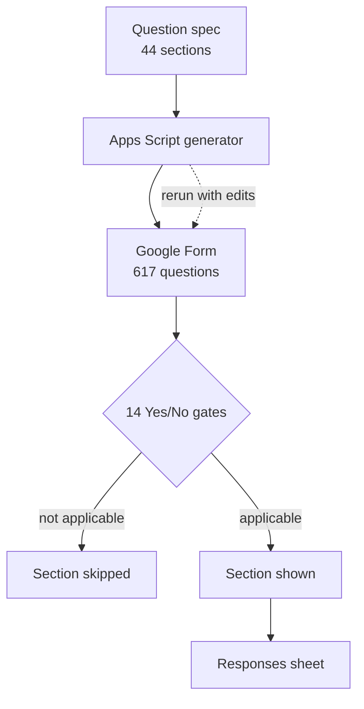

# Google Workspace & Apps Script Automation — case studies

`SANITIZED CLIENT CASE STUDIES`

**Project type:** Sanitized client case studies + one internal tool
**Evidence sources:** completed Upwork contract (5.0), completed Fiverr orders and reviews, historical account audit
**Status:** delivered

Scripting work inside Google Workspace: repairing and extending Apps Script in
client spreadsheets, building a form system too large to assemble by hand, and
troubleshooting Workspace itself when a feature stops behaving.

---

## Why this work comes up

A spreadsheet that a business actually runs on almost never stays a spreadsheet.
Someone adds a script to email a summary, or to stamp a date, or to pull a second
sheet in. Then that person leaves, the script breaks against a changed column,
and nobody in the building knows what it was supposed to do. That repair job is
most of what gets handed to me.

---

## Engagements

### 1. Excel & Google Sheets script modification — Upwork

Modifying existing spreadsheet automation for a client. Delivered and accepted;
the contract closed at **5.0** and is listed as an Upwork Profile Highlight.

**Tools.** Google Sheets · Google Apps Script · Excel

### 2. Google Sheets scripting — Fiverr

Repeat Google Sheets script work delivered through Fiverr, with client reviews
recorded against that service in the account history.

**Tools.** Google Sheets · Google Apps Script

### 3. Google Workspace / Gemini Canvas export troubleshooting — Upwork

A Workspace-admin troubleshooting job: diagnosing why a Gemini Canvas export was
failing for the client and getting it working. Listed as an Upwork Profile
Highlight.

**Tools.** Google Workspace admin · Gemini

### 4. Large conditional intake form, built by script — internal tool

A tax-return client-intake form far too large to build by hand in the Google
Forms UI, so it was generated programmatically instead: **44 sections, 617
questions and 14 conditional Yes/No gates** that route a respondent past the
sections that do not apply to them.

Building it as an Apps Script generator rather than by clicking has a second
benefit — the form is reproducible. Next year's edition is a rerun with edits,
not a rebuild.

**Tools.** Google Apps Script · Google Forms · conditional section routing

**Project type.** Internal tool, built for my own practice — not client work.

---

## Architecture — the generated form system

The most substantial of the four engagements:

Building it as a generator rather than by clicking makes it reproducible: next
year's edition is a rerun with edits, not a rebuild.

## Implementation notes

Client scripts are not published. Where a script was written or repaired inside a
client's own spreadsheet, the code belongs to them and is intentionally omitted;
so are their sheets, columns and data.

## Privacy

No client names, no spreadsheet contents, no form responses, no credentials.

## Related

- [table-to-sheets](https://github.com/skmalikllc/table-to-sheets) — my open-source Chrome extension for getting web tables into Sheets cleanly
- [automation-portfolio](https://github.com/skmalikllc/automation-portfolio)
